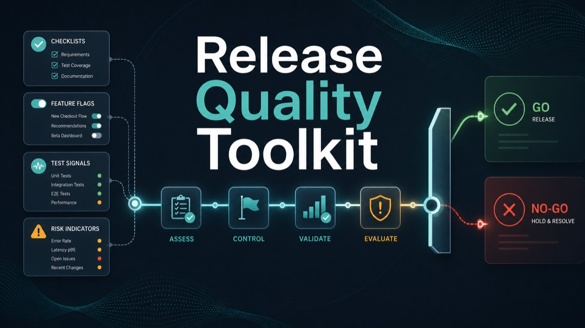
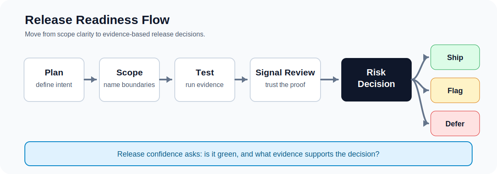
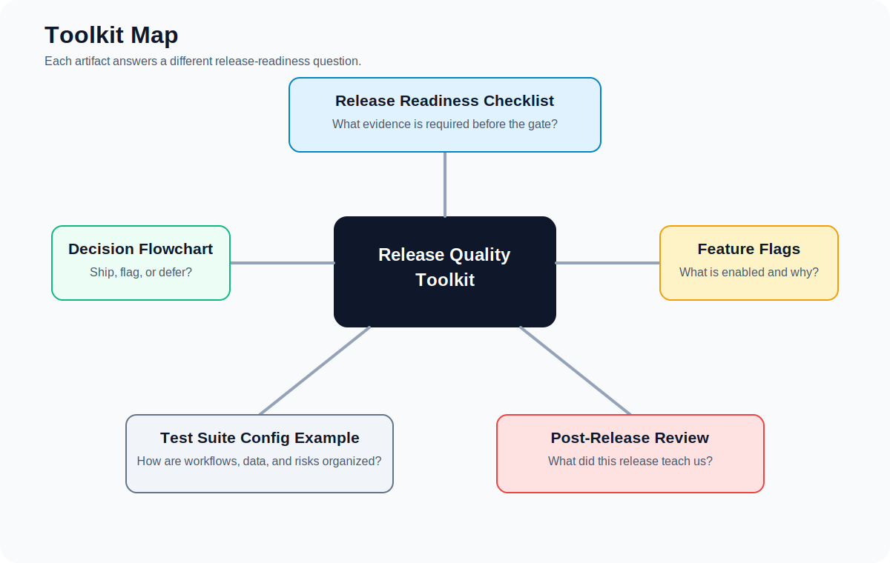
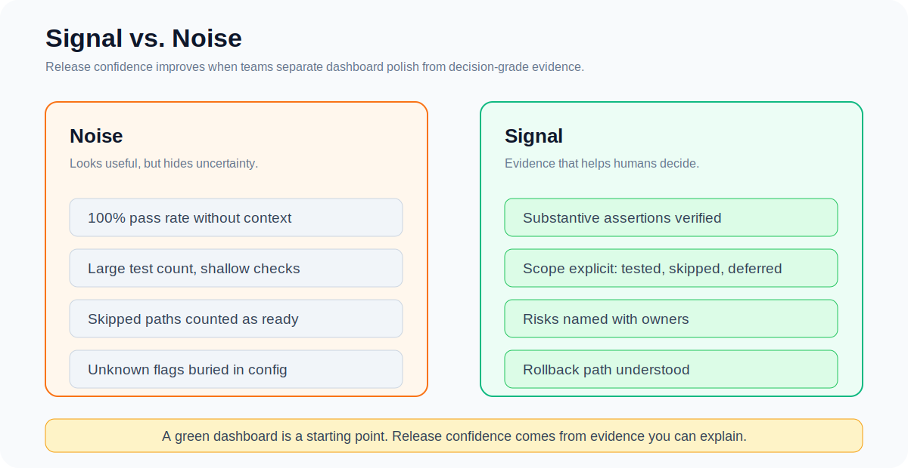
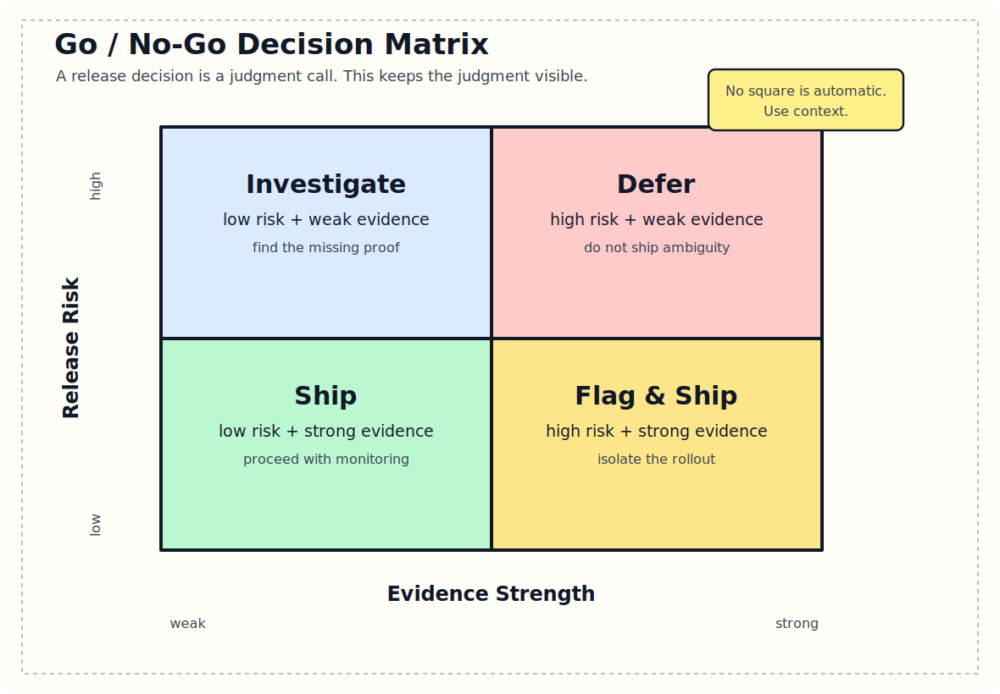
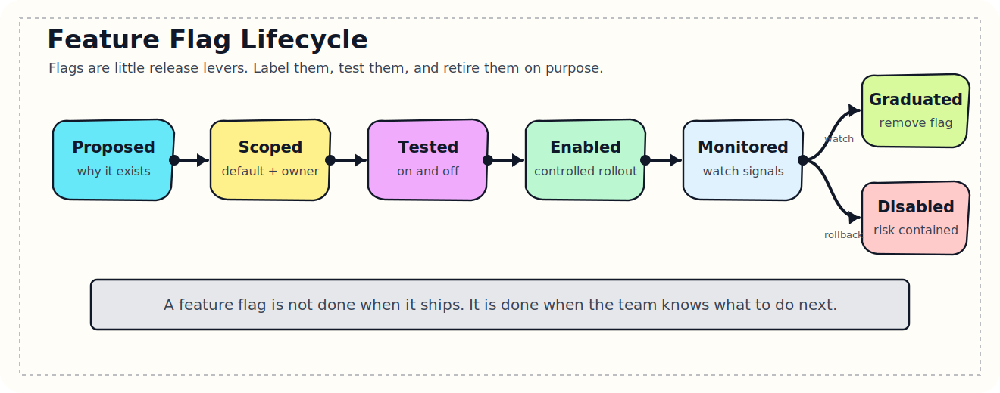

# Release Quality Toolkit

Reusable release readiness artifacts for teams that want better confidence signals, clearer scope boundaries, and fewer surprises between "release candidate" and "production."

This toolkit is built around a simple idea:

> A release process should help teams make better decisions, not just produce better-looking status reports.

The templates here are intentionally lightweight. They are meant to be copied, adapted, and argued with. Use what helps. Change what does not fit your context.

## What's Included

- [Release Readiness Checklist](./release-readiness-checklist.md): Pre-release and release-candidate gates for scope, testing, documentation, risk, and sign-off.
- [Release Decision Flowchart](./release-decision-flowchart.md): A practical decision tree for shipping, deferring, or feature-flagging work.
- [Feature Flag Inventory Template](./feature-flag-inventory-template.md): A structured way to track flag status, scope, test coverage, dependencies, and rollback plans.
- [Post-Release Review Template](./post-release-review-template.md): A retrospective format focused on signal gaps, process improvements, and lessons for the next release.
- [Test Suite Config Example](./test-suite-config-example.yml): A generalized YAML example for organizing automated tests by workflow, dependency, data source, and risk.

## Who This Is For

This toolkit is useful for:

- Quality engineers
- Release managers
- Engineering managers
- Product managers
- DevOps and platform teams
- Anyone responsible for deciding whether a release is ready

It is especially helpful when your system has multiple workflows, feature flags, customer configurations, test data dependencies, or environment-specific behavior.

## Guiding Principles

- **Signal over noise:** A dashboard is only useful if the underlying evidence deserves trust.
- **Scope must be explicit:** Hidden scope creates release chaos.
- **Feature flags are release tools:** Flags should reduce risk, not hide ambiguity.
- **Documentation is part of quality:** Stale or missing docs are a release risk.
- **Post-release learning matters:** The next release should benefit from what the last one taught you.
- **Passing is not enough:** A test can be green and still fail to prove anything meaningful.

## Suggested Workflow

1. Use the release decision flowchart during planning to decide what should ship, defer, or ship behind a flag.
2. Build a feature flag inventory before release candidate testing begins.
3. Run the release readiness checklist before cutting a candidate and again before user acceptance or production.
4. Use the test suite config example to organize coverage by workflow, risk, data, and dependency.
5. Run a post-release review one to two weeks after launch and feed the action items into the next cycle.

## Visual Guides

### Toolkit Map

### Signal vs. Noise

### Go / No-Go Decision Matrix

### Feature Flag Lifecycle

## Public Use Notes

The examples in this repo are generalized. They are based on real release management patterns, but they avoid customer-specific details, proprietary implementation details, and internal-only process references.

If you adapt these templates, replace the sample workflows, flags, owners, environments, and decision thresholds with language that matches your own team.

## Maintainer

Created by Erin Crise as a practical collection of quality engineering and release management patterns.
